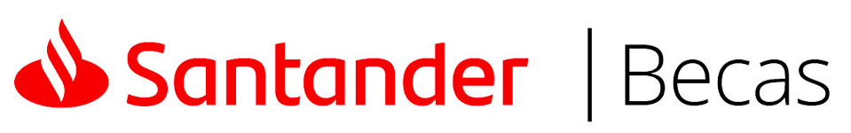

  

  <strong>Repositório dedicado ao BootCamp Backend Java ofertado pelo programa Santander Becas.</strong>

Breve Resumo:

O Santander, em parceria com a DIO (https://www.dio.me/), o maior ecossistema para profissionais de tecnologia da América Latina, voltou com o Santander Bootcamp 2023: um programa inédito do básico ao avançado para pessoas que querem iniciar uma carreira em desenvolvimento de software ou que já atuam profissionalmente e estão buscando por melhores oportunidades.

