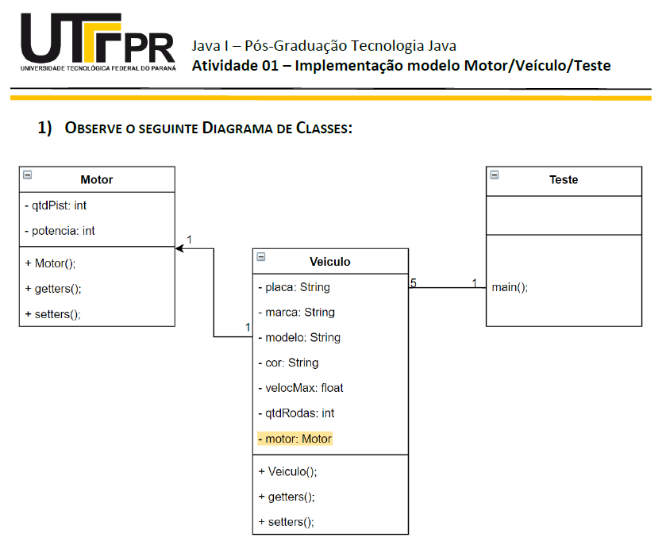

  

  <strong>Diagrama de Classes.</strong>

  

# Descrição:

- DESENVOLVA UMA APLICAÇÃO NA LINGUAGEM DE PROGRAMAÇÃO JAVA ATENDENDO OS SEGUINTES REQUISITOS LISTADOS

## Tópicos abordados:

- Tipos de dados 
- Criar classes/objectos 
- Variáveis de instância/campos 
- Construtores 
- Métodos (getters/acessores, setters/mutadores) 
- Sobrecarga 
- Classes principais/de teste 
- toString() 

### Instruções:

- Todos os métodos construtores default (que não possuem parâmetros formais em sua assinatura) deverão iniciar com 0 (zeros) atributos que sejam de tipos numerais (int, double, float, etc.) e com espaço em branco (“ “) aqueles que forem de tipo literais (char, String e etc).
  
- A classe “Teste” deve ser construída de forma a testar todas as funcionalidades do programa. Nesta deverão ser implementadas as entradas de dados e a impressão destes na tela. Por meio dela deverá ser possível instanciar 5 veículos.
  
- Perceba que, de acordo com as associações descritas no diagrama de classes e suas cardinalidades, a classe “Teste” irá conter apenas objetos do tipo “Veiculo”. Em momento nenhum deverá conter objetos do tipo Motor. No entanto deverá, por meio de um objeto do tipo Veiculo, instanciar os atributos do objeto atributo motor, contido na classe Veiculo, que é do tipo Motor.
  
- Perceba que a classe Veículo POSSUI um atributo do tipo Motor.

