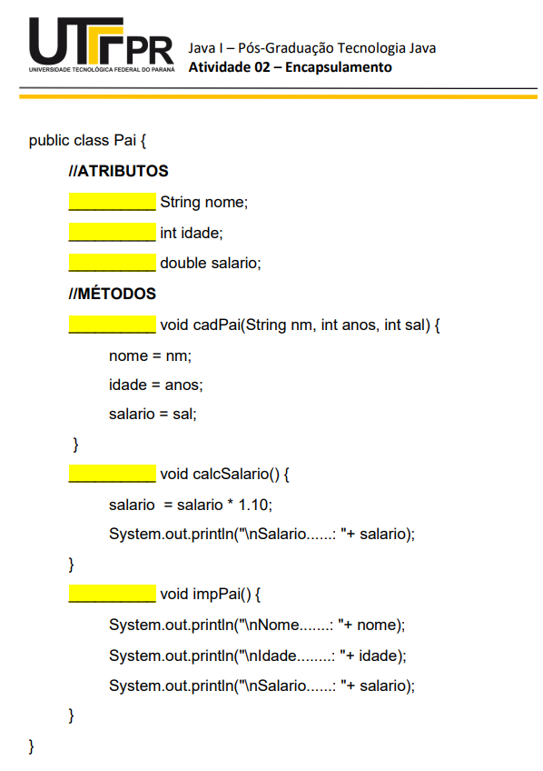

  

  <strong>Classe.</strong>

## Descrição:

- Este exercício tem por função testar as restrições de comunicação (trocas de mensagens) entre 
objetos.
- Há diversas maneiras de testar o encapsulamento dos atributos e métodos do arquivo byteCode. 
Uma forma é criando uma classe de teste como bloco de notas e utilizar o compilador Java por 
meio da linha de comandos. Este foi o método adotado nessa solução, executando o arquivo por meio de linha de comando "javac Teste.exe"

