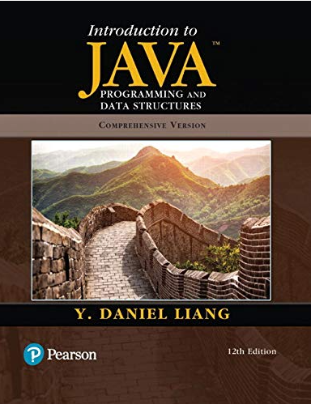

  

Solução dos exercícios do livro ***Introduction to Java Programming and Data Structures, Comprehensive Version 12th Edition - 2019.***, adotado em grande parte das Universidades Americanas no ensino sobre Java. A obra cobre as versões 9, 10 e 11 do Java.

Breve resumo sobre o autor:

O Dr. Liang obteve o seu doutoramento em Ciências da Computação na Universidade de Okalahoma em 1991 e um mestrado e um bacharelato em Ciências da Computação na Universidade de Fudan em Xangai, China, em 1986 e 1983. Antes de se juntar à Armstrong, foi professor associado de ciências informáticas na Universidade Purdue em Fort Wayne, onde recebeu duas vezes o prémio de Excelência em Investigação.

O Dr. Liang tem formação em ciências da computação teóricas. Entre 1990 e 1995, trabalhou ativamente em algoritmos de grafos e publicou mais de dez artigos em várias revistas de renome, como o SIAM Journal on Computing, Discrete Applied Mathematics, Ata Informatics e Information Processing Letters. Desde 1996, tem-se dedicado à redação de textos e publicou mais de trinta livros com a Prentice Hall. Os seus textos populares sobre ciência da computação são amplamente adoptados em todo o mundo.

O Dr. Liang foi eleito Campeão de Java em 2005 pela Sun Microsystems. Tem dado palestras sobre Java a nível internacional.

Breve resumo sobre o livro:

Daniel Liang ensina conceitos de resolução de problemas e de programação orientada para objectos utilizando uma abordagem baseada nos fundamentos. Os programadores principiantes aprendem técnicas críticas de resolução de problemas e, em seguida, passam a compreender os conceitos-chave de orientação a objetos, programação GUI, GUI avançada e programação Web utilizando Java. Liang aborda a programação GUI Java utilizando o JavaFX, não só porque o JavaFX é muito mais simples para os novos programadores Java aprenderem e utilizarem, mas também porque substituiu o Swing como a nova ferramenta GUI para o desenvolvimento de aplicações Internet ricas em plataformas cruzadas em computadores de secretária, em dispositivos portáteis e na Web. Além disso, para os formadores, o JavaFX proporciona uma melhor ferramenta de ensino para demonstrar a programação orientada para objetos.

Capítulos:

Capítulo 1 Introdução aos computadores, programas e Java

Capítulo 2 Programação elementar

Capítulo 3 Selecções

Capítulo 4 Funções matemáticas, caracteres e cadeias de caracteres

Capítulo 5 Laços

Capítulo 6 Métodos

Capítulo 7 Matrizes unidimensionais

Capítulo 8 Matrizes multidimensionais

Capítulo 9 Objetos e classes

Capítulo 10 Pensamento orientado a objectos

Capítulo 11 Herança e polimorfismo

Capítulo 12 Tratamento de exceções e E/S de texto

Capítulo 13 Classes abstratas e interfaces

Capítulo 14 Noções básicas de JavaFX

Capítulo 15 Programação orientada a eventos e animações

Capítulo 16 Controlos de IU JavaFX e multimédia

Capítulo 17 E/S binária

Capítulo 18 Recursão

Capítulo 19 Genéricos

Capítulo 20 Listas, pilhas, filas e filas de prioridade

Capítulo 21 Conjuntos e mapas

Capítulo 22 Desenvolvimento de algoritmos eficientes

Capítulo 23 Ordenação

Capítulo 24 Implementação de listas, pilhas, filas e filas prioritárias

Capítulo 25 Árvores de pesquisa binária

Capítulo 26 Árvores AVL

Capítulo 27 Hashing

Capítulo 28 Grafos e aplicações

Capítulo 29 Grafos ponderados e aplicações

Capítulo 30 Multithreading e programação paralela

Capítulo 31 Redes

Capítulo 32 Programação de banco de dados Java

Capítulo 33 JavaServer Faces

Capítulo 34 JavaFX avançado

Capítulo 35 Programação avançada de banco de dados

Capítulo 36 Internacionalização

Capítulo 37 Servlets

Capítulo 38 Páginas JavaServer

Capítulo 39 Serviços Web

Capítulo 40 2-4 Árvores e árvores B

Capítulo 41 Árvores vermelho-preto

Capítulo 42 Teste usando JUnit

Apêndices

Apêndice A Palavras-chave Java

Apêndice B O conjunto de caracteres ASCII

Apêndice C Tabela de precedência de operadores

Apêndice D Modificadores Java

Apêndice E Valores especiais de ponto flutuante

Apêndice F Sistemas numéricos

Apêndice G Operações bit a bit

Apêndice H Expressões regulares

Apêndice I Tipos enumerados

