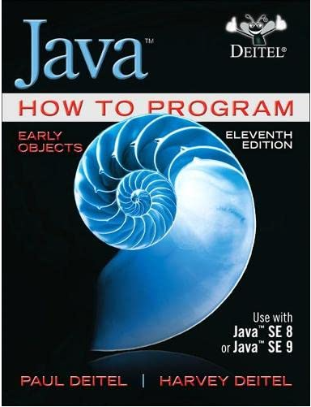

  

Solução dos exercícios - realizados no Intellij -  do livro ***Java: How To Program, Early Objects, 11th edition***, adotado em grande parte das Universidades Americanas no ensino sobre Java. A obra cobre as versões 8 e 9 do Java.

Site da editora: https://www.pearson.com/en-us/subject-catalog/p/java-how-to-program-early-objects/P200000003428/9780137505166

Breve resumo sobre o autor:

O Dr. Harvey M. Deitel, Presidente e Diretor de Estratégia da Deitel & Associates, Inc., tem 58 anos de experiência em informática. O Dr. Deitel obteve os graus de B.S. e M.S. em Engenharia Eléctrica pelo MIT e um doutoramento em Matemática pela Universidade de Boston - estudou computação em cada um destes programas antes de terem criado programas de Ciências Informáticas. Tem uma vasta experiência de ensino universitário, incluindo a obtenção de estabilidade e a função de Presidente do Departamento de Ciências Informáticas no Boston College antes de fundar a Deitel & Associates, Inc., em 1991, com o seu filho, Paul. As publicações da Deitel ganharam reconhecimento internacional, com mais de 100 traduções publicadas em japonês, alemão, russo, espanhol, francês, polaco, italiano, chinês simplificado, chinês tradicional, coreano, português, grego, urdu e turco. O Dr. Deitel ministrou centenas de cursos de programação a clientes académicos, industriais, governamentais e militares.

Breve resumo sobre o livro:

A inovadora série How to Program dos Deitels oferece uma amplitude e profundidade sem paralelo dos fundamentos da programação, conceitos de programação orientada para objectos e tópicos de nível intermédio para estudo posterior. Java How to Program, Early Objects, 11ª edição, apresenta tecnologias de computação de ponta usando a abordagem de código ao vivo com a assinatura Deitel, que demonstra conceitos em centenas de programas de trabalho completos. A 11ª edição apresenta uma cobertura actualizada do Java SE 8 e das novas capacidades do Java SE 9, incluindo o JShell, o Java Module System e outros tópicos importantes do Java 9. 

Capítulos:
